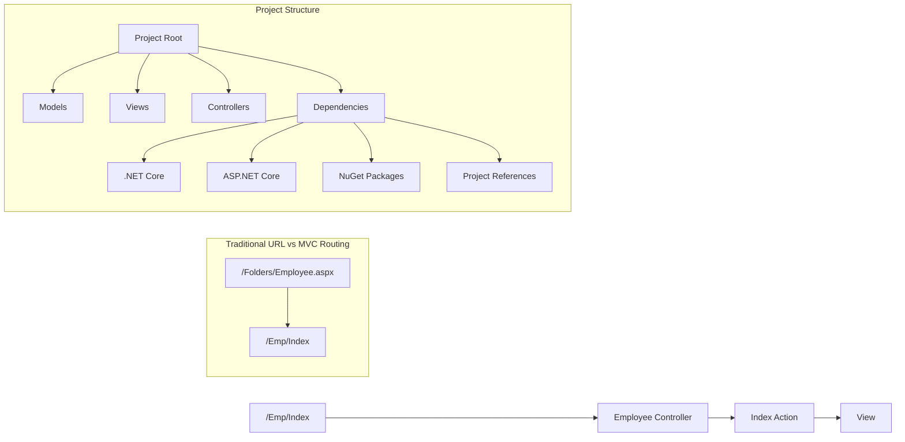

# ASP.NET MVC Project Setup and Structure Guide

## Project Creation Process

### 1. Prerequisites
- Visual Studio installed
- ASP.NET and web development workload
  ```plaintext
  To Install:
  1. Open Visual Studio Installer
  2. Modify → Select "ASP.NET and web development"
  3. Install → This adds ASP.NET runtime and SDK
  ```

### 2. Project Setup Steps
```plaintext
1. Open Visual Studio
2. Create New Project
3. Search for "ASP.NET"
4. Select "ASP.NET Core Web App (Model-View-Controller)"
5. Configure Project:
   - Project name
   - Location
   - Solution name
6. Additional Settings:
   - Framework selection
   - Authentication: None
   - Uncheck "Use top-level statements"
```

## Project Structure

### 1. Core Folders
```
ProjectRoot/
├── Controllers/
│   └── Employee controller files (.cs)
├── Models/
│   └── Data model classes (.cs)
├── Views/
│   └── Razor view files (.cshtml)
└── Program.cs
```

### 2. Dependencies
- **Framework Dependencies**
  - .NET Core runtime
  - ASP.NET Core packages
- **Additional References**
  - NuGet packages
  - Project references (in Projects tab)
  - DLL references

## Key Features

### 1. MVC Routing
```csharp
// URL Pattern: /{controller}/{action}
// Example: /Emp/Index maps to:
public class EmpController : Controller
{
    public IActionResult Index()
    {
        return View();
    }
}
```

### 2. Razor Engine Capabilities
```cshtml
<!-- Views/Emp/Index.cshtml -->
@model List<Employee>

<h1>Employee List</h1>
@foreach(var emp in Model)
{
    <div>@emp.Name</div>
}
```

## Project Components

### 1. Program.cs
```csharp
public class Program
{
    public static void Main(string[] args)
    {
        // Application startup configuration
        var builder = WebApplication.CreateBuilder(args);
        builder.Services.AddControllersWithViews();
        // ... other configurations
    }
}
```

### 2. Controller Structure
```csharp
public class EmpController : Controller
{
    // Action methods
    public IActionResult Index()
    {
        return View();
    }
}
```

### 3. Views Structure
```plaintext
Views/
├── Emp/
│   └── Index.cshtml
├── Shared/
│   └── _Layout.cshtml
└── _ViewImports.cshtml
```

## Routing Benefits

### 1. Clean URLs
- Old: `/Folders/Pages/Employee.aspx`
- New: `/Emp/Index`

### 2. Pattern-Based Routing
- Format: `/{controller}/{action}/{id?}`
- Maps to controller classes and action methods
- Optional parameters supported

## Best Practices

### 1. Project Organization
- Keep controllers thin
- Use appropriate folder structure
- Maintain naming conventions

### 2. Razor Views
- Use partial views for reusability
- Leverage layout pages
- Implement view models when needed

### 3. Dependencies
- Manage through NuGet when possible
- Keep references organized
- Update packages regularly



